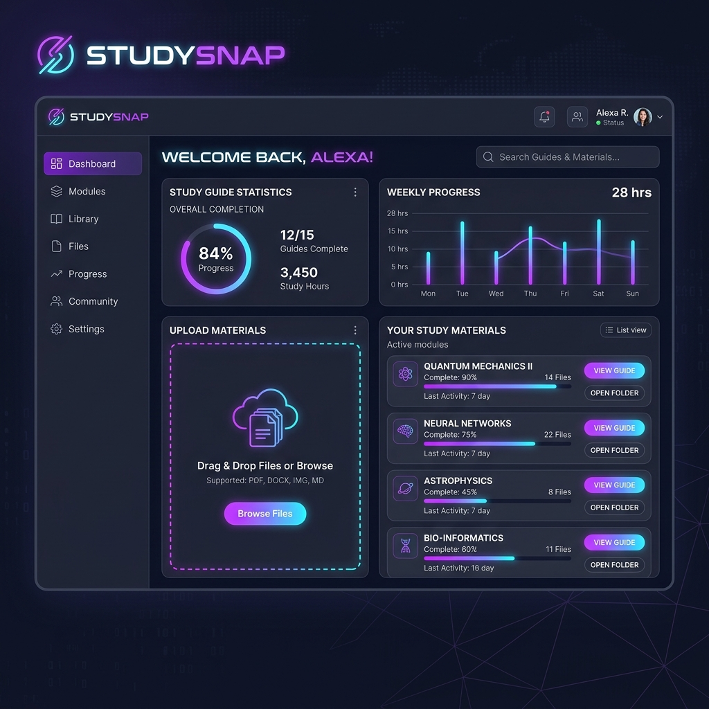
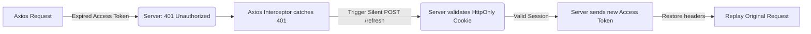

# ⚡ StudySnap — Sci-Fi AI Exam Prep Portal

StudySnap is a high-performance, futuristic cyber-themed web application designed to help students optimize their exam preparation. By uploading course syllabi or chapter PDFs, students receive custom-tailored, high-yield study guides generated via Google's **Gemini 2.5 Flash** model. 

The application implements a robust asynchronous background processing pipeline using **BullMQ**, **Redis**, and **Server-Sent Events (SSE)** to stream AI-generated study materials to the client in real-time as they print.

---

## 🎨 Visual Preview

Below is a look at the StudySnap student workspace, featuring a glassmorphic dashboard interface, interactive statistics cards, a drag-and-drop PDF upload wizard, and the student's active materials catalogue:



---

## 🛠️ Technology Stack

StudySnap is built using a modern, decouple full-stack Javascript architecture:

### Frontend
*   **Framework:** React 19 (Vite-powered environment)
*   **Routing:** React Router DOM (v7)
*   **HTTP Client:** Axios (configured with request/response interceptors for token refresh)
*   **Styling:** Custom Vanilla CSS with responsive design tokens, glassmorphism card components, neon keyframes, and HUD-inspired console widgets (defined in [index.css](file:///home/harsha06/Documents/snapstudy/examhelp/client/src/index.css))

### Backend
*   **Runtime:** Node.js (ES Modules syntax)
*   **Framework:** Express.js (configured with security and utility middlewares)
*   **Authentication:** Passport.js (Google OAuth 2.0 Integration) + JSON Web Tokens (JWT)
*   **PDF Parsing:** `pdf-parse` (fast local text extraction engine)
*   **Rate Limiting & Security:** `express-rate-limit` + `helmet` headers

### Database & Cache
*   **Primary Database:** MongoDB Atlas via Mongoose ODM (stores users, summaries, and tokens)
*   **Task Queue & Caching:** Redis (managed via BullMQ for background processing, ioredis for pub/sub messaging)

### AI Infrastructure
*   **AI Engine:** Google Generative AI SDK (`@google/generative-ai`)
*   **Model:** `gemini-2.5-flash` (streams structured output; supports automatic non-streaming fallback and rate-limit retries)

---

## 📐 Architecture & Data Flow

StudySnap processes heavy PDF operations asynchronously in the background. The flow below describes how an upload is parsed, queued, generated, and streamed live to the client:

```mermaid
sequenceDiagram
    autonumber
    actor Student
    participant React as React Client
    participant Express as Express Server
    participant DB as MongoDB
    participant Queue as BullMQ (Redis)
    participant Worker as Background Worker
    participant Gemini as Google Gemini API
    participant PubSub as Redis Pub/Sub

    Student->>React: Upload PDF & set exam horizon
    React->>Express: POST /api/summarize (multipart)
    Note over Express: Parse text, check daily limit
    Express->>DB: Create Summary (PENDING) & update daily counts
    Express->>Queue: Enqueue Job data
    Express-->>React: 202 Accepted (summaryId)
    
    rect rgb(20, 25, 35)
        Note over React: Redirect to Detail Page
        React->>Express: Establish SSE connection (/stream)
        Express->>PubSub: Subscribe to 'summary:id' channel
    end

    rect rgb(30, 20, 40)
        Queue->>Worker: Pull job from queue
        Worker->>DB: Update Summary status (PROCESSING)
        Worker->>Gemini: Stream content stream request
        loop Generation
            Gemini-->>Worker: Stream text chunk
            Worker->>PubSub: Publish chunk
            PubSub-->>Express: Receive chunk
            Express-->>React: Push SSE message (chunk)
            Note over React: Append & render Markdown
        end
        Worker->>DB: Update Summary (DONE, summaryText)
        Worker->>PubSub: Publish done: true
        PubSub-->>Express: Receive done signal
        Express-->>React: Push SSE message (done)
        Note over Express, React: Close Stream
    end
```



### Detailed Flow Steps:
1.  **Request Initiation:** The student uploads a file via the frontend wizard page.
2.  **Validation & Insertion:** Express receives the file, extracts raw text, updates the student's daily request count, creates a [Summary.js](file:///home/harsha06/Documents/snapstudy/examhelp/server/src/models/Summary.js) record with `PENDING` status, and schedules a job on Redis. The PDF file is immediately unlinked (deleted) from local storage to keep disk space clean.
3.  **SSE Streaming Trigger:** The client immediately receives a `202 Accepted` response with the `summaryId` and redirects to the [SummaryDetail.jsx](file:///home/harsha06/Documents/snapstudy/examhelp/client/src/pages/SummaryDetail.jsx) page, establishing a Server-Sent Events (SSE) connection using a browser-compatible token validation format.
4.  **Worker Processing:** The background worker pulls the job, targets the database state to `PROCESSING`, and invokes the Gemini service with structural rules dynamically modified by the target exam horizon (e.g. 1-hour crisis triage, 24-hour scannable, or 1-week+ comprehensive guides).
5.  **Live Publishing:** Gemini text chunks are published immediately to a Redis channel. The SSE router listens to this pub/sub channel and flushes the text stream to the client.
6.  **Completion:** Upon stream finalization, the worker writes the accumulated text to the database, updates the status to `DONE`, sends a finish packet, and cleans up the Redis listeners.

---

## 📂 Project Structure

```text
examhelp/
├── client/                     # React Single Page Application
│   ├── public/                 # Static public assets (Vercel rewrite handlers)
│   │   └── vercel.json         # Vercel deployment & rewrite configs
│   ├── src/
│   │   ├── api/
│   │   │   └── api.js          # Centralized Axios client & route interceptors
│   │   ├── components/
│   │   │   ├── UI/             # Shared component blocks (Buttons, Modals, Tabs)
│   │   │   ├── Layout.jsx      # Navigation layout wrapper
│   │   │   ├── Navbar.jsx      # Header showing student AI limits
│   │   │   └── Sidebar.jsx     # Side menu routing panel
│   │   ├── context/
│   │   │   ├── AuthContext.jsx # Global auth sessions provider
│   │   │   └── ToastContext.jsx# Custom alert notification provider
│   │   ├── pages/
│   │   │   ├── Auth.jsx        # Login/Signup forms
│   │   │   ├── AuthCallback.jsx# Handles Google OAuth redirect parsing
│   │   │   ├── Dashboard.jsx   # List guides & launches upload wizard
│   │   │   ├── ExamModule.jsx  # Interactive quiz center
│   │   │   ├── Landing.jsx     # Futuristic landing intro
│   │   │   ├── StudentModule.jsx# User profile, analytics & SVG credential generator
│   │   │   └── SummaryDetail.jsx# Live SSE streaming & Markdown reader page
│   │   ├── App.jsx             # React router structure & background drift elements
│   │   ├── index.css           # Core styling tokens & design systems
│   │   └── main.jsx            # Frontend bootstrapper
│   ├── package.json
│   └── vite.config.js          # Vite config & development local API proxies
├── server/                     # Express API & Background Processing Service
│   ├── src/
│   │   ├── middleware/
│   │   │   ├── rateLimiter.js  # Brute force protection on auth routes
│   │   │   ├── upload.js       # Multer configuration for file uploads
│   │   │   └── verifyJWT.js    # JWT authorization validator
│   │   ├── models/
│   │   │   ├── RefreshToken.js # Active sessions schema
│   │   │   ├── Summary.js      # AI Summary schema
│   │   │   └── User.js         # User registration details schema
│   │   ├── queues/
│   │   │   └── summarizeQueue.js# BullMQ queue instantiator
│   │   ├── routes/
│   │   │   ├── auth.js         # Session endpoints (login, signup, refresh, OAuth)
│   │   │   ├── summaries.js    # Saved guides CRUD
│   │   │   ├── summarize.js    # PDF uploading & SSE stream routing
│   │   │   └── user.js         # Profile metrics fetches
│   │   ├── services/
│   │   │   ├── GeminiService.js# Google Generative AI API integrations
│   │   │   ├── passportStrategy.js# Google OAuth Passport strategy configuration
│   │   │   └── pdfService.js   # PDF-parse text extraction
│   │   ├── utils/
│   │   │   ├── db.js           # Mongoose DB connector
│   │   │   ├── jwt.js          # Token encoders, validators & database records
│   │   │   ├── keepalive.js    # Auto-ping checks
│   │   │   ├── promptBuilder.js# Compiles custom study triage prompts
│   │   │   └── redis.js        # Redis connection instantiators
│   │   ├── workers/
│   │   │   └── summarizeWorker.js# Background BullMQ queue task processor
│   │   └── index.js            # Express server entry point
│   ├── env.example             # Template env parameters
│   └── package.json
├── docs/                       # Documentation assets
└── package.json                # Root package configuration
```

---

## 🚀 Local Development Setup

To run the application locally on your machine:

### 1. Prerequisites
Ensure you have the following services installed and running locally:
*   [Node.js](https://nodejs.org/) (version 18+ recommended)
*   [MongoDB](https://www.mongodb.com/try/download/community) (running locally on port 27017 or a MongoDB Atlas cloud URI)
*   [Redis](https://redis.io/) (running locally on port 6379)

### 2. Configure Environment Variables
Create a file named `.env` inside the `server/` directory and populate it with the variables from [env.example](file:///home/harsha06/Documents/snapstudy/examhelp/server/env.example):

```bash
# Database Configuration
MONGODB_URI=mongodb://localhost:27017/studysnap
REDIS_URL=redis://127.0.0.1:6379

# Google OAuth Configuration (Obtained from Google Cloud Console)
GOOGLE_CLIENT_ID=your-google-client-id.apps.googleusercontent.com
GOOGLE_CLIENT_SECRET=your-google-client-secret
GOOGLE_CALLBACK_URL=http://localhost:5000/api/auth/google/callback

# JWT Security Secrets (Use long, random 32+ character strings)
JWT_SECRET=your-super-secret-jwt-key-min-32-chars
JWT_REFRESH_SECRET=your-super-secret-refresh-key-min-32-chars

# AI Engine Credentials
GEMINI_API_KEY=your-gemini-api-key

# Client Application URL
CLIENT_URL=http://localhost:5173
PORT=5000
NODE_ENV=development
```

### 3. Install Dependencies
Run npm install in both directories to build packages:
```bash
# Install server dependencies
cd server && npm install

# Install client dependencies
cd ../client && npm install
```

### 4. Running the Application
StudySnap needs three services running simultaneously (you can open multiple terminal sessions or run them in background):

*   **Start the Express API Server:**
    ```bash
    cd server
    npm run dev
    ```
    *Starts the backend on `http://localhost:5000`.*
    *(Note: By default, the worker script is imported and initiated inside [index.js](file:///home/harsha06/Documents/snapstudy/examhelp/server/src/index.js) during development. If you wish to separate the Express instance and the worker instance in production, you can run them separately).*

*   **Start a Dedicated Background Worker (Optional separation):**
    ```bash
    cd server
    npm run worker
    ```

*   **Start the Vite Frontend Client:**
    ```bash
    cd client
    npm run dev
    ```
    *Spins up the development browser on `http://localhost:5173` with automatic API proxy maps.*

---

## 🔒 Authentication Settings & Flow

StudySnap provides a secure, modern session management architecture leveraging **JWT (JSON Web Tokens)** and **Passport.js Google OAuth 2.0**:

### 1. Access & Refresh Token System
The security design maintains a decoupled balance between front and backend:
*   **Access Token:** Short-lived JWT containing basic payload credentials, stored solely **in memory** by the React app. It is attached as a `Bearer` token to Axios headers via [api.js](file:///home/harsha06/Documents/snapstudy/examhelp/client/src/api/api.js) request interceptors.
*   **Refresh Token:** Long-lived (7 days) token encrypted and saved inside MongoDB. It is set on the client via an **HttpOnly, Secure (in production), SameSite** cookie, protecting it from XSS and CSRF scripts.

### 2. Silent Token Refresh Flow
1.  When an API request returns a `401 Unauthorized` status (indicating the short-lived access token has expired), the Axios response interceptor intercepts the failure.
2.  Axios automatically halts active incoming requests and triggers a silent `POST /api/auth/refresh` request.
3.  The server validates the HttpOnly cookie token against the DB. If valid, it returns a new short-lived access token.
4.  Axios sets the new in-memory access token and replays the original failed requests.



### 3. Google OAuth Flow
1.  Frontend directs client to `GET /api/auth/google`.
2.  Backend redirects student to Google Sign-In interface.
3.  Upon successful login, Google redirects back to `GET /api/auth/google/callback`.
4.  Passport processes user profile details, generates access/refresh tokens, sets the cookie, and performs a redirect to the frontend callback redirect route:
    `${CLIENT_URL}/auth/callback?token=${accessToken}`.
5.  React mounts [AuthCallback.jsx](file:///home/harsha06/Documents/snapstudy/examhelp/client/src/pages/AuthCallback.jsx), extracts the token from URL parameters, registers it in `AuthContext`, and forwards the student to `/dashboard`.

---

## 📡 API Endpoints Reference

All API endpoints are prefixed with `/api`:

### Authentication Module
| Endpoint | Method | Authorization | Description | Request Body | Response Payload |
| :--- | :---: | :---: | :--- | :--- | :--- |
| `/auth/signup` | `POST` | Public | Registers a new standard email/password user | `{ name, email, password }` | `{ accessToken }` |
| `/auth/login` | `POST` | Public | Logs in a registered email/password user | `{ email, password }` | `{ accessToken }` |
| `/auth/google` | `GET` | Public | Initiates Google OAuth sequence | *None* | Redirect to Google |
| `/auth/google/callback` | `GET` | Public | Target redirect callback for Google | *None* | Sets cookie; redirects to client |
| `/auth/refresh` | `POST` | HttpOnly Cookie | Validates session & issues new access token | *None* | `{ accessToken }` |
| `/auth/logout` | `POST` | Public | Revokes refresh token & clears active cookies | *None* | `{ message }` |

### User Profile Module
| Endpoint | Method | Authorization | Description | Request Body | Response Payload |
| :--- | :---: | :---: | :--- | :--- | :--- |
| `/user/me` | `GET` | Bearer Token | Fetches the active user profile & daily AI request usage limits | *None* | `{ id, email, name, avatarUrl, dailyRequestCount, dailyLimit, createdAt }` |

### AI Generation & Queue Module
| Endpoint | Method | Authorization | Description | Request Body | Response Payload |
| :--- | :---: | :---: | :--- | :--- | :--- |
| `/summarize` | `POST` | Bearer Token | Uploads a study PDF, parses text, and schedules worker job | `FormData` (`pdf` binary, `examTime`, `summaryType`, `focusTopic`) | `{ summaryId, truncated, message }` |
| `/summary/:summaryId/stream` | `GET` | Bearer/Query Token | Initiates SSE stream to pipe real-time text chunks | *Query Parameter:* `token` | Text Stream (Server-Sent Events) |

### Study Guide Library Module (CRUD)
| Endpoint | Method | Authorization | Description | Request Body | Response Payload |
| :--- | :---: | :---: | :--- | :--- | :--- |
| `/summaries` | `GET` | Bearer Token | Lists all study guides generated by the student | *None* | `[{ id, fileName, examTime, summaryType, status, createdAt }]` |
| `/summary/:id` | `GET` | Bearer Token | Fetches the complete study guide text & metadata details | *None* | Full `Summary` document object |
| `/summary/:id` | `DELETE` | Bearer Token | Permanently deletes a study guide | *None* | `{ message }` |

---

## 🛠️ Diagnostics & Error Mitigation

*   **Rate Limits:** High-priority endpoints such as login, signup, refresh, and OAuth routes carry a rate-limiter check defined in [rateLimiter.js](file:///home/harsha06/Documents/snapstudy/examhelp/server/src/middleware/rateLimiter.js). If exceeded, it returns a `429 Too Many Requests` status.
*   **Daily Request Budgets:** Standard users carry a strict limit of 10 uploaded PDFs per calendar day (which resets dynamically at midnight based on timezone dates).
*   **Gemini Failure Fallbacks:** If a chunk-based network parsing failure occurs during real-time streaming, [GeminiService.js](file:///home/harsha06/Documents/snapstudy/examhelp/server/src/services/GeminiService.js) automatically reverts to a full non-streaming request (`generateContent`), preserving study guide generation robustness.
*   **BullMQ Unrecoverable Failures:** Quota limits (429) and size limit warnings (413) returned from the Gemini API are handled inside [summarizeWorker.js](file:///home/harsha06/Documents/snapstudy/examhelp/server/src/workers/summarizeWorker.js). These are classified as `UnrecoverableError` states, preventing unnecessary queue retries and immediately updating the database status to `FAILED` with helpful diagnostic logs.
